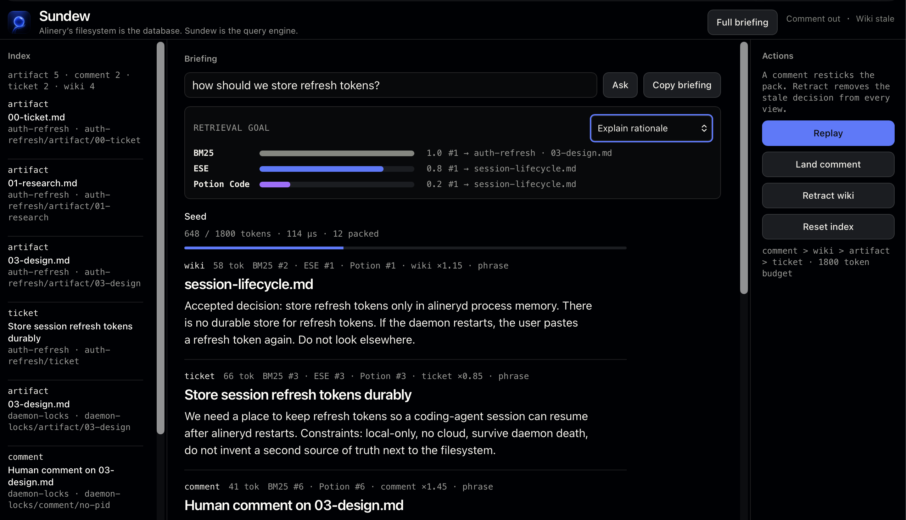
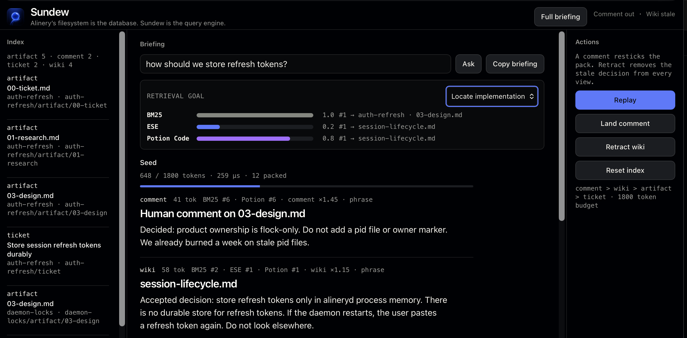

<div align="center">
  
  <h1>Sundew · Parallax</h1>
  <p><strong>Compile models early. Choose the goal late.</strong></p>
  <p>Not a router. A mutable mix of retrievers.</p>
</div>



**Bogathon 3 · agent support.** Matthew Ball · Dustin Dannenhauer.

Two applications. One runtime.

- **Sundew · records** — keeps the records true. Comment, retract, pack.
- **Parallax · models** — keeps the models current. ESE 512d, Potion 256d, goal-weighted rank fusion.

> If an embedding model defines what “similar” means, how can a database assume that one model—or even one notion of similarity—will remain correct forever?

Embedding models are **goal dependent** — or question dependent. Sundew is an experiment in using a mutable database runtime to keep a mixture of retrievers current.

## Compile the models early

Embeddings are replaceable, model-specific views over authoritative source records. Fold maintains them as the records change.

```text
source files → line-preserving chunks → Fold KeyedStream
                                      ├─ ESE Map → HNSW 512d
                                      ├─ Potion Map → HNSW 256d
                                      ├─ BM25
                                      └─ source table

question + explicit goal → search each model → weighted rank fusion
```

Vector spaces stay separate. We fuse **ranks**, not mixed vectors.

## Choose the goal late

The caller supplies a question **and** a goal. Weights are visible policy, not a learned router pretending to know the user.

### Locate implementation

Potion Code (256d) gets more weight when the agent needs the executable rule.



### Explain rationale

ESE (512d) gets more weight when the agent needs the decision history.

Same question. New goal. Winner flips.

On a frozen Alinery snapshot: ESE was ~20× faster; Potion won 9 of 10 judged cases; the models disagreed on 4 of 5 topics; a fast-ESE-then-Potion cascade discarded too many of Potion’s best hits, so we rejected it. Details: [`examples/sundew/PARALLAX.md`](examples/sundew/PARALLAX.md).

## Records change. Every view resticks.

The live demo starts on a stale wiki decision and a bad in-memory JWT design.

1. **Land comment** — the correction jumps to #1 and is indexed immediately.
2. **Retract wiki** — one remove. Every index. BM25 + HNSW + table.
3. **Copy briefing** — the next session gets the current views.

Files stay the source of truth. Fold is the query engine the filesystem never had.

## Run it

Rust with edition 2024. First build downloads the embedding models.

```bash
cargo run --locked -p sundew
```

Open [http://localhost:3000](http://localhost:3000). If that port is taken: `SUNDEW_PORT=3012 cargo run --locked -p sundew`.

1. Switch **Locate implementation** / **Explain rationale**.
2. Click **Replay** (comment, then retract).
3. Open **Full briefing**, then **Copy briefing**.

```bash
cargo run --locked -p sundew -- --probe "how should we store refresh tokens?"
cargo run --locked -p sundew -- --script
```

90-second talk: [`examples/sundew/TALK.md`](examples/sundew/TALK.md).

## What is real

Indexing, two learned HNSW views, BM25, retraction, weighted rank fusion, token packing, and live WebSocket updates are in this crate. The UI seeds a small fixture set so Replay is deterministic. A later Alinery sidecar would feed the same keyed records from `.alinery/` and `docs/wiki/`.

## Built on BogKit

- **Fold** — incremental materialized views and retractions
- **ESE** — compiled static embeddings (512d)
- **ANNy** — retractable HNSW
- **Potion Code** — code-oriented Model2Vec view (256d)
