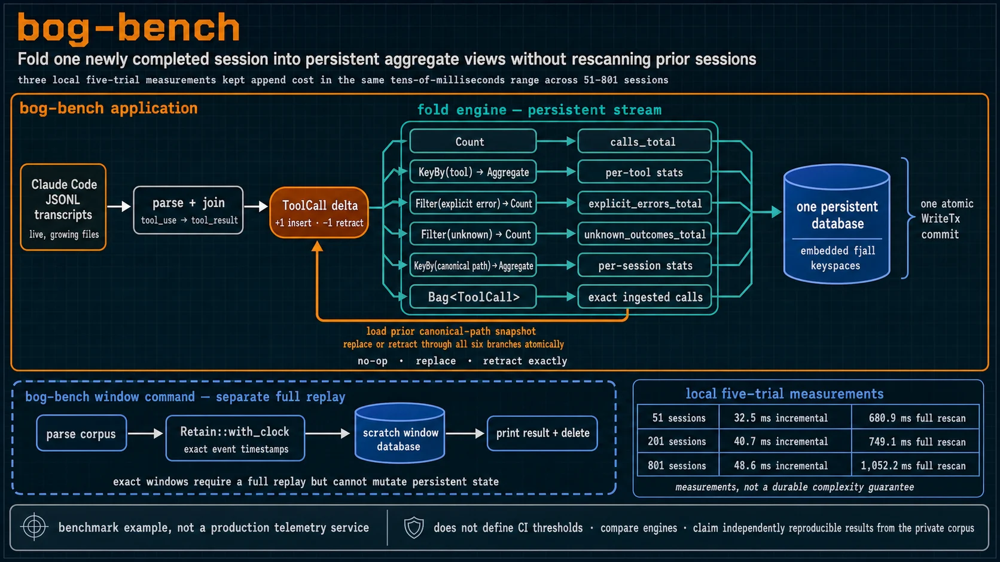
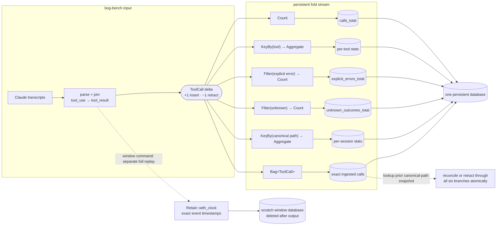

# bog-bench

**Fold one newly completed session into persistent aggregate views without
rescanning prior sessions; three local five-trial measurements kept append cost
in the same tens-of-milliseconds range across 51–801 sessions.**



Category: **performance**

```console
$ cargo run -p bog-bench -- demo
```

Materialized-view rows from the output (session-ranking lines omitted):

```text
== ingested session-a ==
5 tool calls · 1 explicit error among 5 known outcomes · 0 unknown outcomes

  TOOL                        CALLS  ERROR    UNK  ERROR%       CHARS     ~TOK
  Read                            2      0      0      0%       23600     5900
  Bash                            2      1      0     50%        2740      685
  Edit                            1      0      0      0%         180       45

== appended session-b — views moved, nothing rescanned ==
9 tool calls · 3 explicit errors among 9 known outcomes · 0 unknown outcomes

  TOOL                        CALLS  ERROR    UNK  ERROR%       CHARS     ~TOK
  Read                            3      0      0      0%       67600    16900
  Bash                            4      3      0     75%        6640     1660
  Grep                            1      0      0      0%        3300      825
  Edit                            1      0      0      0%         180       45

== retracted session-b — every counter rolled back ==
5 tool calls · 1 explicit error among 5 known outcomes · 0 unknown outcomes
```

The demo uses a process-unique scratch database and deletes it afterward. It
cannot modify the persistent CLI database. Running `bog-bench` with no
arguments prints help and does not open either database.

An agent's context window is scarce, and much of what fills it is the agent's
own tooling: a `Read` returning thousands of characters, a command carrying an
explicit error flag, or an incomplete call whose result never arrived.

bog-bench turns those calls into persistent materialized views. Ordinary ingest
updates the persistent aggregate views from deltas without rescanning prior
sessions; `retract` reads the exact stored snapshot, while `window` performs a
separate full replay. The comparison arm in `bench` is intentionally a full
rescan.

## Run it

Everything beyond `demo` reads Claude Code history from
`~/.claude/projects`:

| command | what it does |
|---|---|
| `demo` | Run ingest → append → retract on isolated fixtures |
| `recent <n>` | Reconcile the *n* newest transcript snapshots |
| `show` | Print the current persistent views |
| `ingest <path>` | Reconcile one transcript with its stored snapshot |
| `retract <path>` | Retract the exact snapshot previously ingested |
| `bench <n> <trials>` | Compare repeated incremental and full-rescan trials |
| `window <hours> <n>` | Replay an exact event-time rolling window |
| `reset` | Clear the versioned persistent database |

Each command is a separate process. The state between commands lives in
`bog-bench-v2.db` under the system temporary directory:

```console
$ cargo run -p bog-bench -- reset
$ cargo run -p bog-bench -- recent 200
$ cargo run -p bog-bench -- show
$ cargo run -p bog-bench -- retract <transcript>
```

### Growing transcripts and exact retraction

Transcript identity is the canonical path, not the file stem. Two projects may
therefore ingest files with the same name without colliding.

The sixth persistent pipeline branch is a counted `Bag<ToolCall>` containing
the exact calls represented by the five aggregate branches. Reconciliation
reads the prior bag entries for a canonical path:

- identical snapshot: no-op;
- appended or otherwise changed snapshot: remove the prior calls and insert the
  current calls in one fold transaction;
- retraction: remove only the stored calls, without reparsing the current file.

This handles a transcript that grows after its first ingest. It also prevents a
later mutation from making `retract` subtract calls that were never inserted.
The exact-call bag and all aggregate views commit atomically in the same fold
transaction.

## The benchmark

```console
$ cargo run -p bog-bench -- bench 800 5
```

Both arms include parse and fold time:

- **incremental** — open an existing persistent corpus, parse one arriving
  session, and fold that session;
- **rescan** — parse the selected corpus and build every view from an empty
  database.

Before reporting timings, every trial compares total calls, explicit-error and
unknown counts, every per-tool row, every per-session row, and the exact-call
bag. A mismatch exits non-zero.

These measurements were collected on `macos/aarch64`, debug profile, 8 logical
CPUs, five trials per corpus size:

| corpus | arriving calls | incremental total median (min–max, σ) | rescan total median (min–max, σ) |
|---|---:|---:|---:|
| 51 sessions | 290 | 32.5 ms (29.0–37.2, 2.7) | 680.9 ms (601.4–717.2, 42.0) |
| 201 sessions | 291 | 40.7 ms (35.8–70.9, 14.2) | 749.1 ms (704.9–1,050.0, 133.2) |
| 801 sessions | 292 | 48.6 ms (38.4–50.8, 4.6) | 1,052.2 ms (908.6–1,154.0, 82.4) |

The selected corpus was live, so the newest transcript grew slightly between
the three commands. These results show the incremental arm remaining in the
same tens-of-milliseconds range while the full replay grew across this local
range. They are measurements, not a durable complexity guarantee; other
machines, stores, corpora, profiles, and workloads need their own repeated
trials.

This output could support a future CI policy. The current CLI reports metrics
but does not yet define a baseline, threshold, or pass/fail gate.

## Exact rolling window

```console
$ cargo run -p bog-bench -- window 24 400
```

`Retain` normally stamps every record in a transaction with one processing-time
clock value. An hourly replay batch would therefore move an early call forward
to the last timestamp in its hour.

bog-bench instead sorts calls by event time, advances the synthetic clock at
each distinct event timestamp, and commits calls sharing only that exact
timestamp. At the final event, a call exactly on the cutoff remains and a call
one millisecond before it expires. A deterministic one-hour cutoff regression
test covers both sides of that boundary.

`window` uses its own scratch stream and deletes it after printing. It does not
add a rolling-window branch to the persistent database.

## Outcomes and parser diagnostics

A call has one of three outcomes:

| outcome | evidence |
|---|---|
| `Success` | A matching result arrived without an explicit error flag |
| `ExplicitError` | The producer or result payload carried `is_error: true` |
| `Unknown` | A tool invocation had no matching result |

`ERROR%` is explicit errors divided by known outcomes. Unknown calls are shown
in `UNK` and excluded from that denominator; they are not silently counted as
successes.

Malformed JSON, non-object records, malformed `tool_use` blocks, unmatched
results, unmatched calls, lossy UTF-8 conversion, and read errors are counted
as parse diagnostics and printed to stderr. Parsing still degrades gracefully
so one bad line does not discard the rest of a transcript.

`CHARS` is the normalized character count of the joined tool-result content,
not raw JSON payload size and not total model context cost. `~TOK` is the
explicitly labeled `chars / 4` estimate. Neither is attributed model token
usage.

## Tests and CI

```console
$ cargo test -p bog-bench
$ cargo test --release -p bog-bench
```

Nineteen debug-build test functions: seventeen deterministic fixture-based
tests and two local-corpus smoke checks that return early when no corpus is
present. Release builds run eighteen because the intentional debug-assert panic
reproduction is compiled out.

The deterministic tests cover:

- exact snapshot reconciliation for appended transcripts;
- retraction after the source mutates;
- canonical-path identity for same-stem files;
- isolated demo state and non-destructive no-argument invocation;
- persistence across separate CLI processes;
- exact window cutoff boundaries;
- unknown outcomes and parse diagnostics;
- full-view incremental/rescan equivalence;
- repeated benchmark output and environment/spread reporting;
- fold insertion/retraction invariants using the production pipeline.

Repository CI runs `cargo test --workspace` in both debug and release profiles.

In one private 114-session corpus, the parser recorded 2,668 tool calls, 100
carrying explicit error flags. One browser-automation tool had 5 flagged errors
across 10 calls and averaged approximately 4,200 normalized result characters
per call. These observations are not independently reproducible from this PR.

## What is being benchmarked

The workload is Claude Code JSONL transcripts. They are live files that can
grow, contain several result shapes, and occasionally contain invalid UTF-8 or
malformed lines.

The subject is `fold`'s persistent incremental update path compared with a
from-empty full replay using the same engine. There is no SQLite, DuckDB, or
`HashMap` throughput baseline. Such a comparison would need to hold
persistence and retraction semantics constant.

The comparison arm is a full-rescan batch design; incremental or cached systems
can also avoid rescans but must supply their own persistence and retraction
semantics.

## Materialized views

The persistent stream has six branches over the same `ToolCall` delta:



The rolling window is intentionally outside the persistent pipeline. The
previous diagram incorrectly showed it as a durable branch and omitted
`calls_total` and the exact snapshot state.

## Persistence boundaries

`fold` stores each named sink in an embedded fjall keyspace. Reads use one
consistent snapshot, and `WriteTx::commit` atomically commits all branches.
bog-bench does not call `checkpoint()`, so its commits are crash-safe when they
return but are not explicitly fsynced for OS or power loss.

| choice | consequence |
|---|---|
| exact-call bag in the main transaction | aggregates and retraction source stay consistent |
| canonical path identity | same-stem files do not collide |
| one writer | concurrent ingest processes are unsupported |
| versioned `bog-bench-v2.db` | the old aggregate-only schema is left untouched |
| separate scratch window stream | exact windows require a full replay but cannot mutate persistent state |
| no `checkpoint()` | a power-loss window can lose recent commits; rerun `recent <n>` to reconcile selected files |

## Why fold

An ordinary reducer can maintain the same counters in memory. What `fold`
provides here is one transaction spanning persistent counts, tables, and the
exact multiset needed to reverse or replace a transcript snapshot.

| requirement | fold shape |
|---|---|
| corpus total | `Count` |
| per-tool and per-session rows | `KeyBy → Aggregate → Table` |
| explicit errors and unknowns | `Filter → Count` |
| exact retraction source | `Bag<ToolCall>` |
| event-time replay window | `Retain::with_clock` on a scratch stream |

## Scope

This is a benchmark example, not a production telemetry service. It supports
Claude Code transcripts, one local writer, exact snapshot reconciliation,
retraction, repeated local benchmark trials, and exact replay windows. It does
not define CI thresholds, compare engines, surface latency percentiles, or
claim independently reproducible results from the private corpus.
