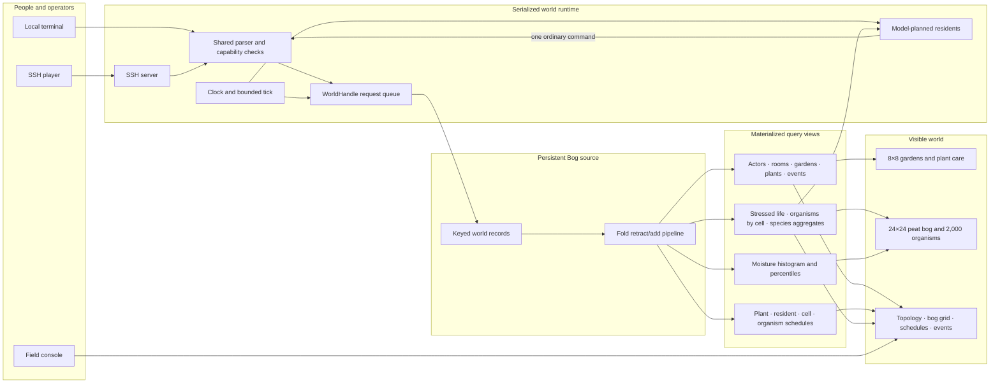

# MUDGarden feature map

This map describes the implementation as it exists now. “Live” means the path
is implemented and covered by automated tests; it does not imply that every
simulation dimension is biologically complete.

## Player and social world — live

- SSH usernames select persistent identities and bind to public keys; one key
  may back multiple usernames without merging their profiles.
- Every actor has one private home garden plus access to connected shared
  spaces: common paths, glasshouse, moon bed, pond, compost, and Wild Edge.
- Rooms expose directional travel, present inhabitants, live relevant events,
  reconnect summaries, and bounded event history.
- Players can speak, visit, trade items, lock or unlock their home gate, admit
  a waiting visitor for one entry, and grant or revoke tending rights.
- Sorrel runs a persistent decoration shop on the Common Path. Players trade
  harvested fruit for catalog items, then place, inspect, move, and recover
  decorations on garden coordinates subject to garden permissions.
- A local stdin/stdout mode exercises the same command and world paths.

## Garden simulation — live

- Every garden is an addressable 8×8 board.
- Planting consumes seeds; watering and pruning change condition and growth.
- Plants progress through seed, sprout, growth, flowering, fruiting, and
  dormancy on a ranked schedule.
- Harvesting produces fruit and seeds.
- Plants and decorations share the 8×8 plot grid; persistent decorations appear
  in room descriptions, prose garden views, and the garden board.
- Global season, temperature, and weather affect plants.
- Materialized views answer current plants, due transitions, and “needs water”
  without rebuilding those answers for each command.

## Living peat bog — live

- Defaults: 24×24 habitat cells, 2,000 organisms, 12 semi-realistic bog plant
  species, and at most 160 ecological record updates per world tick.
- Cell state includes water table, moisture, pH, nutrients, temperature, light,
  peat depth, scrub cover, and next transition.
- Organism state includes species, habitat cell, health, biomass, age, life
  stage, and next transition.
- Hydrology includes rainfall, evaporation, four-neighbor lateral flow, and
  biomass-linked uptake. Habitat response includes pH, water, light, seasonal
  growth, competition, peat accumulation, and scrub encroachment.
- `bog` reads species aggregates, stressed-organism counts, and moisture
  percentiles. `survey [x y]` reads a habitat and its indexed residents.
  `restore x y` performs a small, persisted hydrological intervention.
- Fold maintains cell and organism tables, two due schedules, a stressed-life
  set, an organism-by-cell multimap, per-species aggregates, and a moisture
  histogram. Updates retract stale contributions atomically.

## Model-planned residents — live when configured

- Ivo, Wren, Mosswife, and Almanac have distinct persisted goals,
  capabilities, wake intervals, action budgets, and content-defined voices.
- A due resident receives a bounded snapshot, then requests exactly one typed
  command from the configured model outside the serialized world thread.
- Before acting, a resident may make up to four read-only live-world queries
  using the same observation commands available to players. Queries return
  through the serialized world owner and cannot move, speak, or mutate state.
- The returned command goes through the same parser, visibility rules,
  permissions, and mutation path as a human command. Intentions are recorded
  as audit events.
- At the Wild Edge, a resident additionally sees moisture percentiles, the
  stressed count, and four dry restoration candidates. Residents with shared
  tending capability may choose `restore`.
- Without `OPENAI_API_KEY`, the ecological and garden simulations continue;
  residents wake but do not invent fallback actions.

## Operations and observability — live

- The world, identities, inventories, permissions, schedules, bog, and events
  survive checkpoint and process restart.
- The single-owner service serializes mutations while model requests run
  concurrently outside it.
- The HTTP field console shows topology, the bog grid, plant records, derived
  schedules, alerts, and recent events, with controls for the clock, editable
  content, and browser-based test sessions.
- Its agent-action lens exposes each run's exact instructions and supplied
  context, model requests, concise decision rationales, world queries and
  results, selected command, and execution outcome.
- Docker and Railway files support a persistent volume, SSH TCP proxy, and an
  optional separately routed visualizer.
- Bog size, population, per-tick ecology budget, tick speed, content, model,
  addresses, and database paths are configurable by environment.

## Deliberate current limits

- Bog organisms do not yet reproduce, disperse, migrate, or interact through
  a food web; individuals only grow, change stage, and die back.
- Hydrology is local and qualitative rather than a calibrated catchment model.
  Weather is global, and there is no terrain elevation, drainage network, fire,
  grazing, animal population, or nutrient transport model.
- Ecological work is hard-bounded, but model API calls can still dominate cost
  if wake intervals are made aggressive.
- Full agent-action traces are an in-memory operator aid. The visualizer keeps
  the latest 32 completed runs and clears them when the backend restarts.
- The debug visualizer has no application-level authentication and should stay
  loopback-only or behind platform access control.
- `ecology_version` is persisted for future migrations, but migration logic for
  changing the cell schema or reseeding an existing bog is not implemented.
